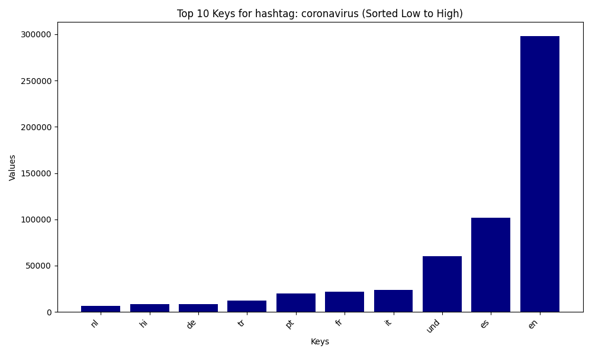
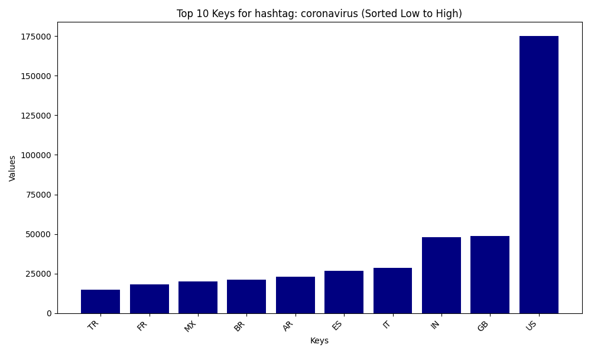
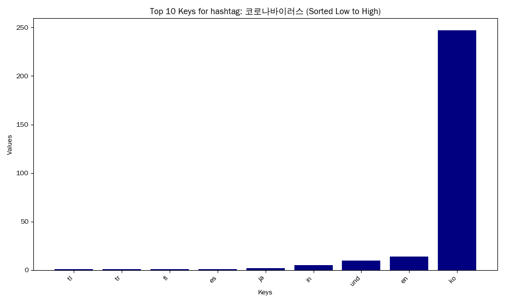
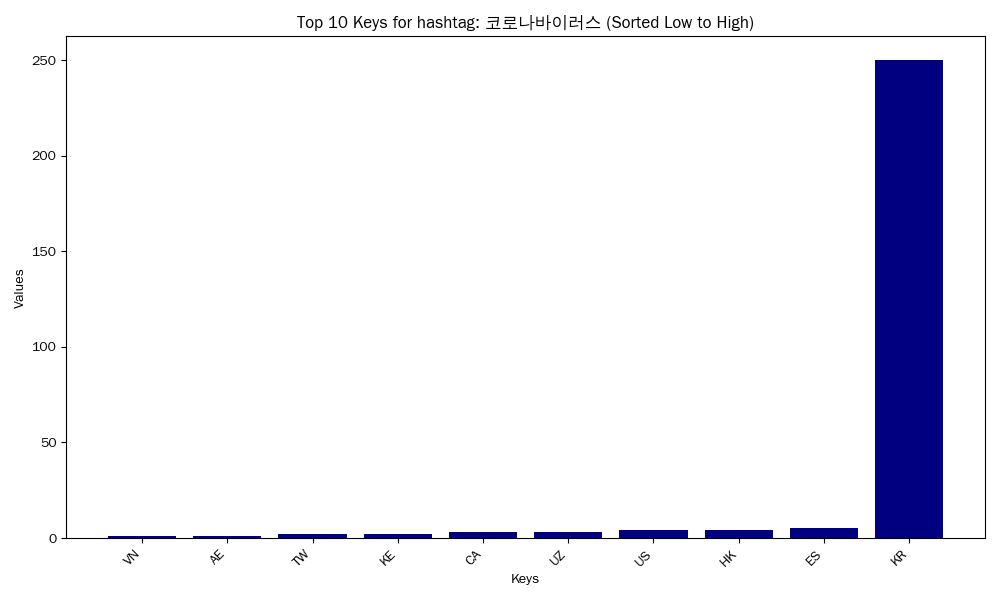
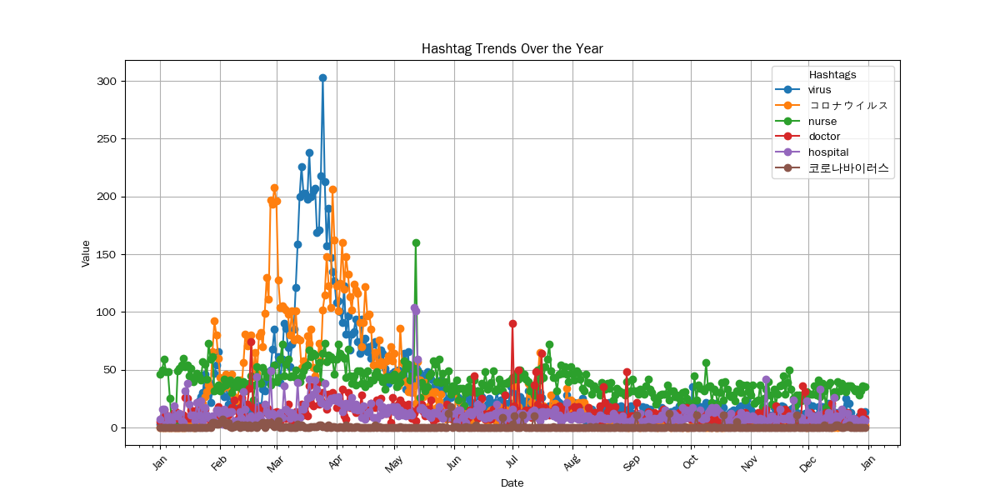

# Coronavirus Twitter Analysis Using MapReduce

I analysed all geotagged tweets in 2020 (which is around 1.1 billion tweets) using MapReduce to visualize the frequency of various COVID-19 related hashtags across dates, countries, and languages. 

**Skills and Techniques Utilized:**
1. Working with large datasets
2. Using MapReduce to run the analysis in parallel
3. Build plots utilizing various languages

## MapReduce 
### Map Step
This first step involves parsing the data and counting the frequency of the hashtags of interest from each language and country. We output a nested dictionary mapping a hashtag to another dictionary mapping language/country to the frequency of tweets sent. I then wrote a script that runs the mapper over all days in 2020 and creates a separate output file for each day. Each day is run in parallel using the `&` command. I also ensured that the program continues sto run after disconnecting from the remote server using the `nohup` command. This step took the longest, as it ran overnight (around 9 hours). 

### Reduce Step
After we are left with 365 x 2 output files for each day filtered for country and language for these hashtags, we want to combine this data into singular `.lang` and `.country` files. I did this by iterating over all the data and again just keeping track of a counter for each hashtag. This step took less than a second to complete (as it was just addition on a much more limited set of data). 

## Visualizations 
These plots were built using matplotlib. These plots help us visualize and sanity-check the success of the MapReduce program. 

### Tweet Frequency using #coronavirus Across Languages 

### Tweet Frequency using #coronavirus Across Countries 

### Tweet Frequency using #코로나바이러스 Across Languages 

### Tweet Frequency using #코로나바이러스 Across Countries 

### Frequency of Select Hashtags Throughout 2020

